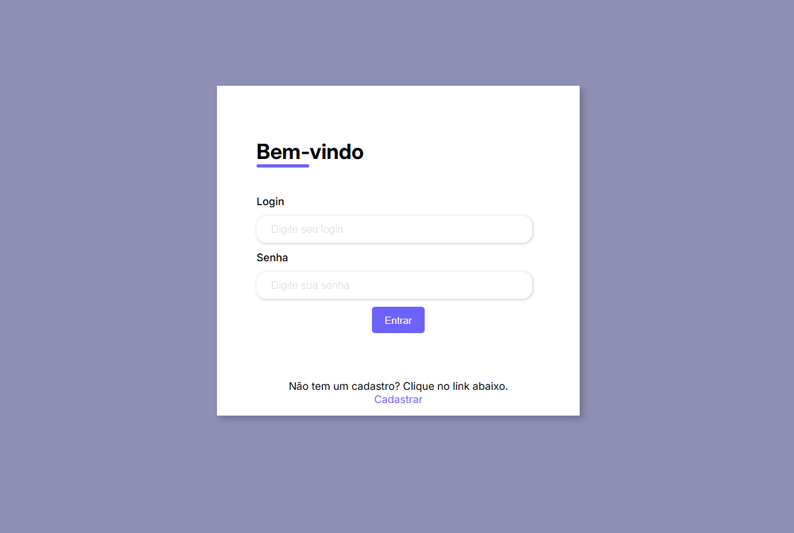
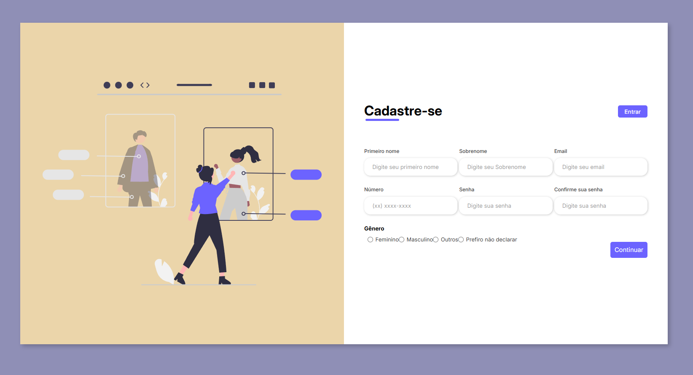

# Página de Cadastro

Projeto de uma aplicação web de cadastro de usuários, desenvolvido em dupla, com o objetivo de evoluir de um frontend estático para uma aplicação completa com backend e banco de dados.

## 🚀 Status do Projeto
🔄 Em desenvolvimento

Atualmente o projeto possui o frontend completo desenvolvido com HTML e CSS.  
As próximas etapas incluem a integração com backend em Java (Spring Boot) e banco de dados MySQL.

## 🛠️ Tecnologias

**Frontend**
- HTML5
- CSS3

**Backend (planejado)**
- Java
- Spring Boot

**Banco de Dados (planejado)**
- MySQL

## 📌 Funcionalidades (atuais)
- Página de cadastro de usuário
- Layout estruturado e estilizado
- Organização de formulário

## 🔮 Funcionalidades futuras
- Integração com backend
- Validação de dados
- Persistência em banco de dados
- Sistema de login

## 👥 Colaboradores
- Leonardo Ferreira  
- Jorge Lucas Teixeira

## 📸 Preview

## 📈 Changelog

### v0.1 - Frontend inicial
- Criação da estrutura HTML
- Estilização com CSS
- Implementação da página de cadastro

### v0.2 - (em andamento)
- Planejamento da integração com backend
